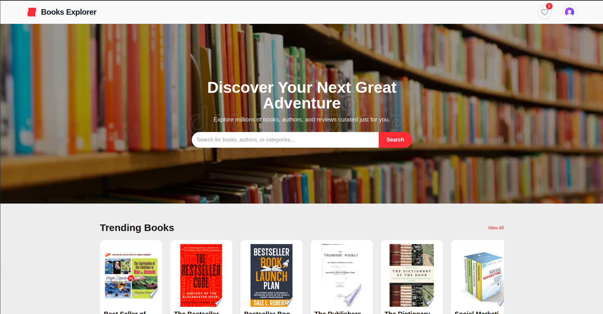
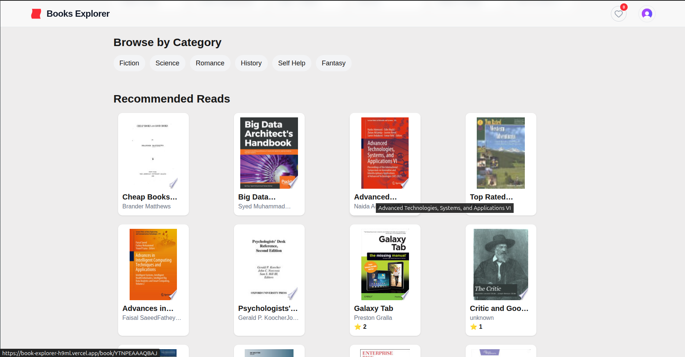
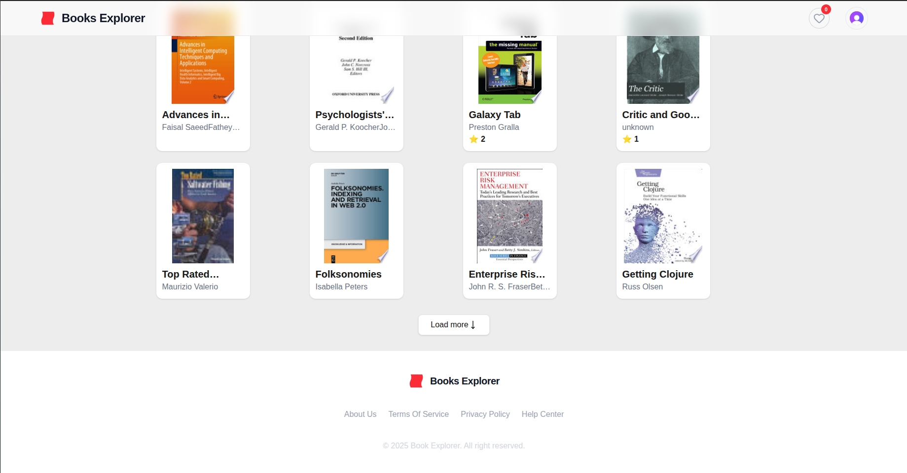
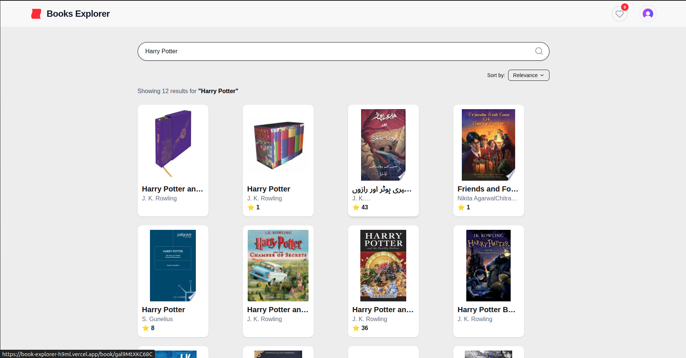
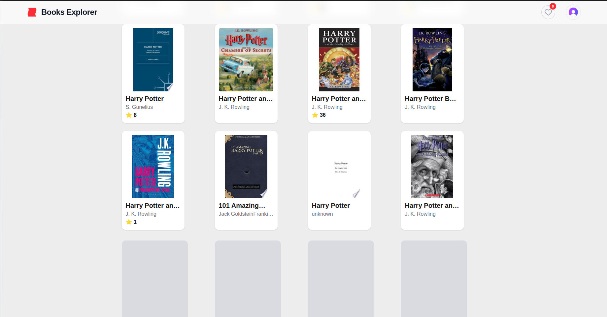
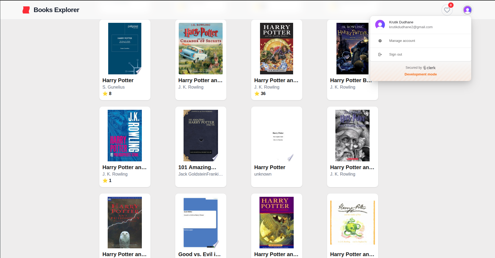

# 📚 Book Explorer – Web App

A fully responsive **Book Explorer** web application built with **Next.js**, allowing users to discover, search, and explore books using the **Google Books API**.  
The app focuses on **clean UI, smooth UX, and performance**, featuring dynamic search, pagination, wishlist functionality, and modern loading states.

---

## 🚀 Tech Stack

-> Next.js (App Router)  
-> React 18  
-> TypeScript  
-> Tailwind CSS  
-> Google Books API  
-> Context API (global state – Wishlist)  
-> Clerk (Authentication)  
-> Vercel (Deployment)  

---

## 🚀 Features

### 🧩 General

-> Clean & modern UI inspired by real-world book platforms  
-> Fully responsive (mobile, tablet, desktop)  
-> Reusable, component-based architecture  
-> Centralized API handling with route handlers  
-> Smooth loading states with skeleton UI  

---

### 🏠 Landing Page

-> Hero section with search functionality  
-> Trending books section  
-> Recommended books section  
-> Paginated “Load More” experience  
-> Skeleton loaders for better perceived performance  

---

### 🔍 Search Page

-> Real-time book search using Google Books API  
-> Query-based routing (`/search?q=book-name`)  
-> Paginated results with Load More  
-> Proper empty & loading states  
-> Search result count display  

---

### 📖 Book Detail Page

-> High-quality book cover  
-> Title, author(s), publisher & published date  
-> Page count & categories  
-> Rich HTML description rendering  
-> Responsive detail layout  

---

### ❤️ Wishlist

-> Add / Remove books from wishlist  
-> Persistent wishlist using localStorage  
-> Wishlist badge in navbar  
-> Dedicated wishlist page  
-> Protected route (Clerk authentication)  

---

### 🔐 Authentication

-> Clerk integration for authentication  
-> Public pages: Landing, Search, Book Details  
-> Protected pages: Wishlist  
-> Seamless redirect after login  

---

### ⚡ Performance & UX Optimizations

-> Skeleton loaders instead of spinners  
-> Client-side pagination without layout shift  
-> Optimized data fetching via API route handlers  
-> Avoids exposing API keys on client  
-> Suspense boundaries for CSR bailouts  

---

## 🛠️ Installation

### 1️⃣ Clone the repository

```bash
git clone https://github.com/your-username/book-explorer.git

  
## Installation


### 1. Clone the repository

```bash
https://github.com/krutikD-dev/book_explorer
```
### 2. Install dependencies
```bash
npm i
```
### 3. Start the development server
```bash
    npm run dev
```
### 4. Build the project for production
```bash
npm run build 
```

## Screenshots

# 📚 Book Explorer – Web App

A fully responsive **Book Explorer** web application built with **Next.js**, allowing users to discover, search, and explore books using the **Google Books API**.  
The app focuses on **clean UI, smooth UX, and performance**, featuring dynamic search, pagination, wishlist functionality, and modern loading states.

---

## 🚀 Tech Stack

-> Next.js (App Router)  
-> React 18  
-> TypeScript  
-> Tailwind CSS  
-> Google Books API  
-> Context API (global state – Wishlist)  
-> Clerk (Authentication)  
-> Vercel (Deployment)  

---

## 🚀 Features

### 🧩 General

-> Clean & modern UI inspired by real-world book platforms  
-> Fully responsive (mobile, tablet, desktop)  
-> Reusable, component-based architecture  
-> Centralized API handling with route handlers  
-> Smooth loading states with skeleton UI  

---

### 🏠 Landing Page

-> Hero section with search functionality  
-> Trending books section  
-> Recommended books section  
-> Paginated “Load More” experience  
-> Skeleton loaders for better perceived performance  

---

### 🔍 Search Page

-> Real-time book search using Google Books API  
-> Query-based routing (`/search?q=book-name`)  
-> Paginated results with Load More  
-> Proper empty & loading states  
-> Search result count display  

---

### 📖 Book Detail Page

-> High-quality book cover  
-> Title, author(s), publisher & published date  
-> Page count & categories  
-> Rich HTML description rendering  
-> Responsive detail layout  

---

### ❤️ Wishlist

-> Add / Remove books from wishlist  
-> Persistent wishlist using localStorage  
-> Wishlist badge in navbar  
-> Dedicated wishlist page  
-> Protected route (Clerk authentication)  

---

### 🔐 Authentication

-> Clerk integration for authentication  
-> Public pages: Landing, Search, Book Details  
-> Protected pages: Wishlist  
-> Seamless redirect after login  

---

### ⚡ Performance & UX Optimizations

-> Skeleton loaders instead of spinners  
-> Client-side pagination without layout shift  
-> Optimized data fetching via API route handlers  
-> Avoids exposing API keys on client  
-> Suspense boundaries for CSR bailouts  

---

## 🛠️ Installation

### 1️⃣ Clone the repository

```bash
git clone https://github.com/your-username/book-explorer.git

  
## Installation


### 1. Clone the repository

```bash
https://github.com/krutikD-dev/book_explorer
```
### 2. Install dependencies
```bash
npm i
```
### 3. Start the development server
```bash
    npm run dev
```
### 4. Build the project for production
```bash
npm run build 
```

## Screenshots

# 📚 Book Explorer – Web App

A fully responsive **Book Explorer** web application built with **Next.js**, allowing users to discover, search, and explore books using the **Google Books API**.  
The app focuses on **clean UI, smooth UX, and performance**, featuring dynamic search, pagination, wishlist functionality, and modern loading states.

---

## 🚀 Tech Stack

-> Next.js (App Router)  
-> React 18  
-> TypeScript  
-> Tailwind CSS  
-> Google Books API  
-> Context API (global state – Wishlist)  
-> Clerk (Authentication)  
-> Vercel (Deployment)  

---

## 🚀 Features

### 🧩 General

-> Clean & modern UI inspired by real-world book platforms  
-> Fully responsive (mobile, tablet, desktop)  
-> Reusable, component-based architecture  
-> Centralized API handling with route handlers  
-> Smooth loading states with skeleton UI  

---

### 🏠 Landing Page

-> Hero section with search functionality  
-> Trending books section  
-> Recommended books section  
-> Paginated “Load More” experience  
-> Skeleton loaders for better perceived performance  

---

### 🔍 Search Page

-> Real-time book search using Google Books API  
-> Query-based routing (`/search?q=book-name`)  
-> Paginated results with Load More  
-> Proper empty & loading states  
-> Search result count display  

---

### 📖 Book Detail Page

-> High-quality book cover  
-> Title, author(s), publisher & published date  
-> Page count & categories  
-> Rich HTML description rendering  
-> Responsive detail layout  

---

### ❤️ Wishlist

-> Add / Remove books from wishlist  
-> Persistent wishlist using localStorage  
-> Wishlist badge in navbar  
-> Dedicated wishlist page  
-> Protected route (Clerk authentication)  

---

### 🔐 Authentication

-> Clerk integration for authentication  
-> Public pages: Landing, Search, Book Details  
-> Protected pages: Wishlist  
-> Seamless redirect after login  

---

### ⚡ Performance & UX Optimizations

-> Skeleton loaders instead of spinners  

---

## 🛠️ Installation

### 1️⃣ Clone the repository

```bash
git clone https://github.com/your-username/book-explorer.git

  
## Installation


### 1. Clone the repository

```bash
https://github.com/krutikD-dev/book_explorer
```
### 2. Install dependencies
```bash
npm i
```
### 3. Start the development server
```bash
    npm run dev
```
### 4. Build the project for production
```bash
npm run build 
```

## Screenshots






